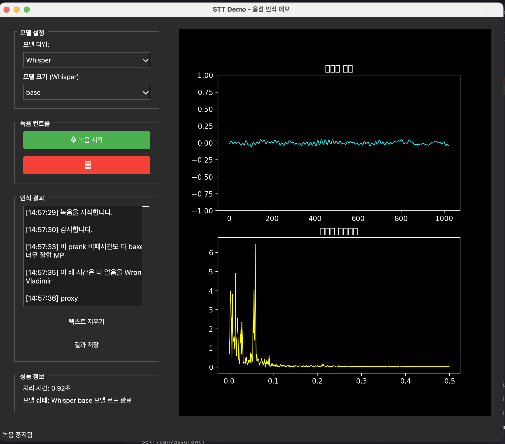
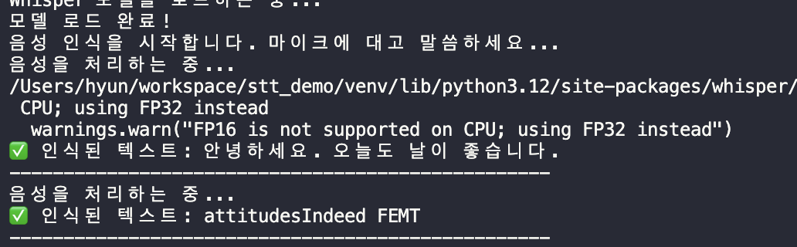
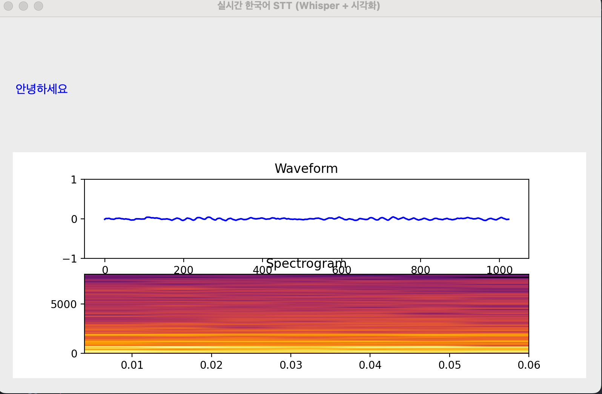
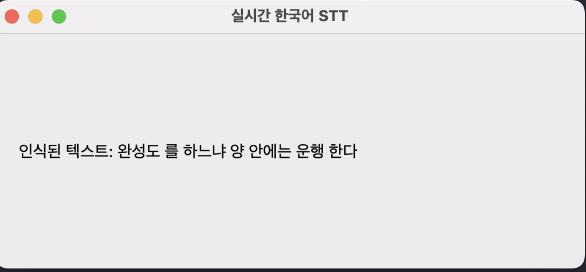

# 🎤 STT Demo - 통합 음성 인식 애플리케이션

[](https://python.org)
[](https://pypi.org/project/PyQt5/)
[](https://github.com/openai/whisper)
[](https://alphacephei.com/vosk/)
[](https://pypi.org/project/PyAudio/)
[](https://matplotlib.org/)
[](LICENSE)

한국어 음성을 실시간으로 텍스트로 변환하는 통합 데모 애플리케이션입니다. 
OpenAI Whisper와 Vosk 모델을 지원하며, 명령줄과 GUI를 하나의 파일로 통합했습니다.

## 📋 목차

- [주요 기능](#-주요-기능)
- [스크린샷](#️-스크린샷)
- [시스템 요구사항](#-시스템-요구사항)
- [설치 방법](#-설치-방법)
- [사용 방법](#-사용-방법)
- [설정](#️-설정)
- [성능 최적화](#-성능-최적화)
- [문제 해결](#-문제-해결)
- [개발자 가이드](#-개발자-가이드)
- [라이센스](#-라이센스)

## ✨ 주요 기능

## ✨ 주요 기능

- 🎤 **실시간 음성 인식**: Whisper와 Vosk 모델 지원
- 📊 **실시간 시각화**: 파형과 주파수 스펙트럼 표시  
- 🖥️ **직관적인 GUI**: PyQt5 기반 사용자 친화적 인터페이스
- 🇰🇷 **한국어 지원**: 한글 폰트 및 Vosk 한국어 모델
- 💾 **결과 저장**: 인식 결과를 텍스트 파일로 저장
- 🎛️ **모델 선택**: Whisper와 Vosk 모델 간 실시간 전환
- 🔧 **통합 CLI**: 하나의 파일로 모든 기능 제공
- ⚡ **고성능**: 콜백 기반 안정적인 오디오 처리

## 🛠️ 기술 스택

| 분야 | 기술 | 용도 |
|------|------|------|
| **GUI** | PyQt5 | 메인 인터페이스 |
| **STT** | OpenAI Whisper, Vosk | 음성 인식 엔진 |
| **오디오** | PyAudio | 실시간 마이크 입력 |
| **시각화** | Matplotlib | 파형/스펙트럼 그래프 |
| **언어** | Python 3.8+ | 핵심 개발 언어 |
| **패키징** | pip, requirements.txt | 의존성 관리 |

## 🔧 시스템 요구사항

### 필수 요구사항
- **Python**: 3.8 이상
- **운영체제**: macOS, Windows, Linux
- **메모리**: 최소 4GB RAM (Whisper large 모델 사용 시 8GB 권장)
- **마이크**: 음성 입력용

### 선택적 요구사항
- **GPU**: CUDA 지원 GPU (Whisper 가속용)
- **Apple Silicon**: M1/M2 Mac (MPS 가속 지원)

## 📦 설치 방법

### 1. 저장소 클론
```bash
git clone <repository-url>
cd stt_demo
```

### 2. 가상환경 생성 (권장)
```bash
python -m venv venv
source venv/bin/activate  # macOS/Linux
# 또는
venv\Scripts\activate     # Windows
```

### 3. 의존성 설치

#### 자동 설치 (권장)
```bash
python run_demo.py install
```

#### 수동 설치
```bash
# 필수 패키지
pip install -r requirements.txt

# Whisper 모델 (권장)
pip install openai-whisper

# Vosk 모델 (경량 대안)
pip install vosk
```

### 4. Vosk 모델 다운로드 (선택사항)
```bash
# 한국어 모델 다운로드
wget https://alphacephei.com/vosk/models/vosk-model-small-ko-0.22.zip
unzip vosk-model-small-ko-0.22.zip
```

## 🚀 사용 방법

### 통합 GUI 실행 (권장)
```bash
python stt_demo.py          # GUI 실행 (기본값)
python stt_demo.py gui      # GUI 실행 (명시적)
```

### 관리 명령어
```bash
python stt_demo.py check    # 패키지 설치 확인
python stt_demo.py install  # 패키지 자동 설치
python stt_demo.py help     # 도움말 보기
```

### 개별 테스트 실행
```bash
# 콘솔 기반 데모들
python tests/test_whisper_basic.py    # Whisper 5초 샘플링
python tests/test_whisper_large.py    # Whisper large 모델
python tests/test_vosk_korean.py      # Vosk 한국어
python tests/test_pyqt5_gui.py        # GUI 테스트
```

## 🖼️ 스크린샷

### 메인 GUI 애플리케이션

*통합 음성 인식 GUI - 실시간 오디오 시각화와 STT 결과 표시*

### Whisper CLI 데모

*명령줄 기반 Whisper 음성 인식 데모*

### 실시간 스펙트럼 분석

*실시간 오디오 파형과 주파수 스펙트럼 시각화*

### Vosk 간단 GUI

*Vosk 모델을 사용한 경량 음성 인식 GUI*

## ⚙️ 설정

`config.json` 파일을 통해 다양한 설정을 조정할 수 있습니다:

```json
{
  "audio": {
    "sample_rate": 16000,
    "chunk_size": 1024,
    "buffer_seconds": 3.0
  },
  "whisper": {
    "default_model": "base",
    "language": "ko",
    "device": "auto"
  },
  "gui": {
    "window_width": 1000,
    "window_height": 700,
    "theme": "dark"
  }
}
```

## 🎯 성능 최적화

### Whisper 모델 선택 가이드
- **tiny**: 가장 빠름, 정확도 낮음 (~39MB)
- **base**: 균형잡힌 성능 (~74MB) - **권장**
- **small**: 좋은 정확도 (~244MB)
- **medium**: 높은 정확도 (~769MB)
- **large**: 최고 정확도 (~1550MB)

### 하드웨어별 권장사항
- **CPU 전용**: base 또는 small 모델
- **CUDA GPU**: medium 또는 large 모델  
- **Apple M1/M2**: medium 모델 (MPS 가속)
- **저사양 시스템**: Vosk 모델

## 🐛 문제 해결

### 일반적인 문제들

#### 1. PyAudio 설치 오류
```bash
# macOS
brew install portaudio
pip install pyaudio

# Ubuntu/Debian
sudo apt-get install portaudio19-dev python3-pyaudio
pip install pyaudio

# Windows
pip install pipwin
pipwin install pyaudio
```

#### 2. 권한 오류 (마이크 접근)
- macOS: 시스템 환경설정 > 보안 및 개인정보 보호 > 마이크
- Windows: 설정 > 개인정보 보호 > 마이크

#### 3. Whisper 모델 다운로드 실패
```bash
# 수동 다운로드
python -c "import whisper; whisper.load_model('base')"
```

#### 4. GPU 가속 문제
```bash
# CUDA 버전 확인
python -c "import torch; print(torch.cuda.is_available())"

# MPS (Apple Silicon) 확인  
python -c "import torch; print(torch.backends.mps.is_available())"
```

### 로그 확인
```bash
# 애플리케이션 로그 확인
tail -f stt_demo.log
```

## 🔧 개발자 가이드

### 프로젝트 구조
```
stt_demo/
├── stt_demo.py              # 통합 애플리케이션 (CLI + GUI)
├── config.py                # 설정 관리 시스템
├── config.json              # 사용자 설정 파일
├── requirements.txt         # 핵심 의존성 목록
├── src/                     # 모듈화된 소스 코드
│   ├── core/               # 핵심 기능 (오디오, STT 처리)
│   ├── gui/                # GUI 컴포넌트
│   ├── models/             # 음성 인식 모델
│   └── utils/              # 유틸리티 함수
├── tests/                  # 테스트 및 예제 파일들
│   ├── test_whisper_basic.py    # Whisper 기본 테스트
│   ├── test_whisper_large.py    # Whisper large 모델 테스트
│   ├── test_whisper_mic.py      # whisper-mic 라이브러리 테스트
│   ├── test_pyqt5_gui.py        # PyQt5 GUI 테스트
│   ├── test_vosk_korean.py      # Vosk 한국어 모델 테스트
│   └── README.md                # 테스트 실행 가이드
├── examples/               # 예제 및 데모 코드
└── vosk-model-small-ko-0.22/    # Vosk 한국어 모델
```

### 새로운 기능 추가
1. `stt_demo.py`의 메인 클래스 수정
2. `config.py`에 새로운 설정 항목 추가
3. 필요시 새로운 스레드 클래스 생성

### 테스트
```bash
# 기본 테스트
python -m pytest tests/

# 개별 테스트 실행
python stt_demo.py check
```

## 📞 문의하기

개발 관련 컨설팅 및 외주 받습니다.

### 👨‍💼 프로젝트 관리자 연락처

**Email**: hyun.lim@okkorea.net  
**Homepage**: https://www.okkorea.net  
**LinkedIn**: https://www.linkedin.com/in/aionlabs/  

### 🛠️ 전문 분야

### 🛠️ Technical Expertise / 기술 전문 분야
- **IoT system design and development / IoT 시스템 설계 및 개발**
- **Embedded software development / 임베디드 소프트웨어 개발** (Arduino, ESP32)
- **AI service development / AI 서비스 개발** (LLM, MCP Agent)
- **Cloud service architecture / 클라우드 서비스 구축** (Google Cloud Platform)
- **Hardware prototyping / 하드웨어 프로토타이핑**

### 💼 Services / 서비스
- **Technical consulting / 기술 컨설팅**: IoT project planning and design consultation / IoT 프로젝트 기획 및 설계 자문
- **Development outsourcing / 개발 외주**: Full-stack development from firmware to cloud / 펌웨어부터 클라우드까지 Full-stack 개발  
- **Educational services / 교육 서비스**: Embedded/IoT development training and mentoring / 임베디드/IoT 개발 교육 및 멘토링  


## 📄 라이선스

이 프로젝트는 MIT 라이선스 하에 제공됩니다. 자세한 내용은 `LICENSE` 파일을 참조하세요.

## 🙏 감사의 글

- [OpenAI Whisper](https://github.com/openai/whisper) - 강력한 음성 인식 모델
- [Vosk](https://alphacephei.com/vosk/) - 경량 음성 인식 엔진
- [PyQt5](https://www.riverbankcomputing.com/software/pyqt/) - 크로스플랫폼 GUI 프레임워크

## 📞 지원

문제가 있거나 질문이 있으시면:
- GitHub Issues에 문제 신고
- 이메일로 문의
- 커뮤니티 포럼 참여

---

**Happy Coding! 🎉**# stt-demo-korean
